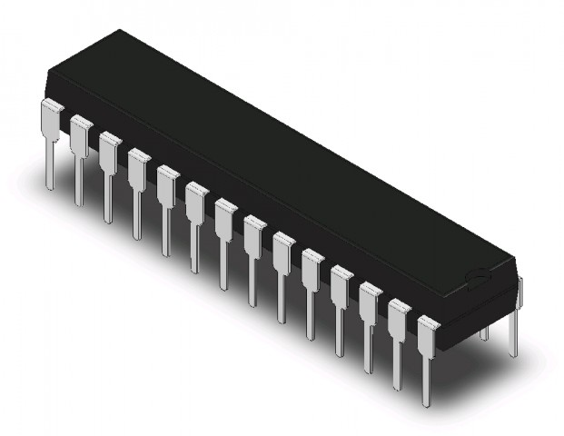
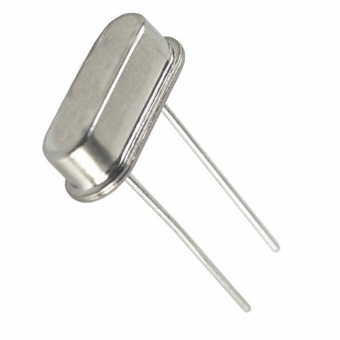
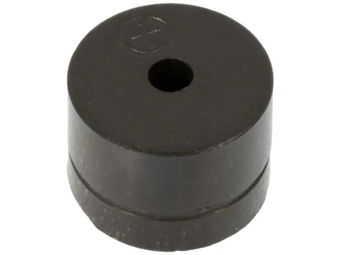
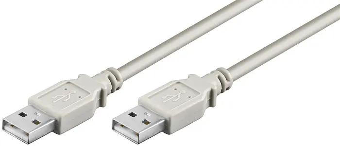

---
tags:
  - buy
  - components
---

# 0. Buy components

Here is the list of all the components to buy:

Picture                       |Name                                 |Description              |Price (kr)
------------------------------|-------------------------------------|-------------------------|------------------------------------------------------------------------------------
|ATMega328P                           |The main Arduino Uno chip|[47](https://www.electrokit.com/atmega328p-pu-dip-28n-8-bit-mcu-flash-32k-picopower)
       |Crystal 16.0000 MHz HC49/S **20pF**  |Sets the clock speed     |[14](https://www.electrokit.com/kristall-16.0000-mhz-hc49/s) (you need to buy 5, you need 1)
   |Ceramic capacitor **22pF** 50V NP0   |Stabilizes the crystal   |[12](https://www.electrokit.com/keramisk-22pf-50v-np0-2.54mm) (you need to buy 10, you need 2)
           |Passive piezobuzzer **5V** PCB       |Generates the sound      |[12](https://www.electrokit.com/piezoelement-12x8.5mm-passiv)
           |UBS-A male cable                     |To plug in the machine   |[26](https://www.electrokit.com/usb-kabel-a-hane-a-hane-1.8m) (you need to buy 1, you need half)
.                             |Shipping                             |The cost to ship         |35
.                             |Total                                |Sum of all costs         |146
