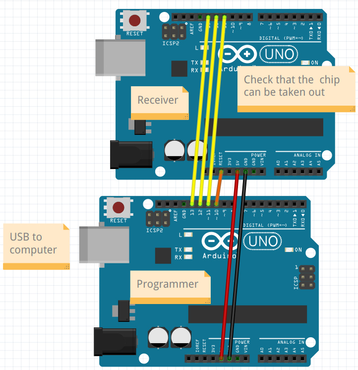
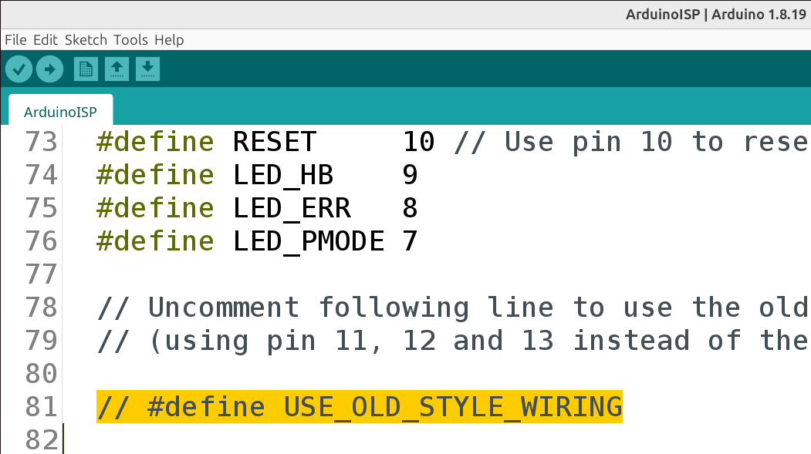
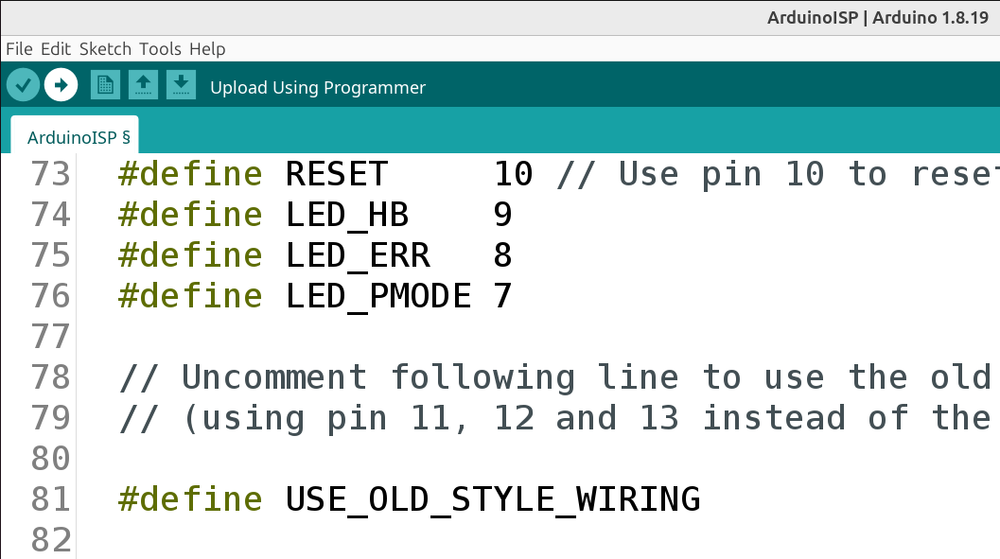
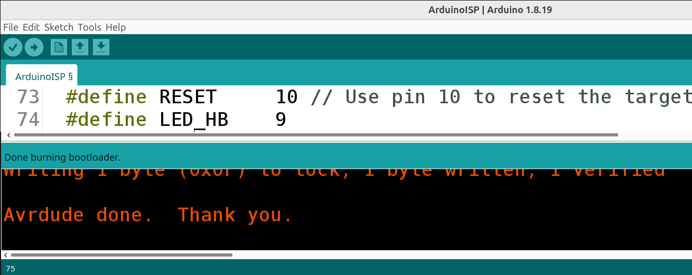

---
tags:
  - burn
  - bootloader
---

# 1. Burn bootloader to chip

When one buys the main Arduino chip (its name is 'ATmega328P'),
it has no bootloader om it. In this step,
we'll burn a bootloader on the chip

## 1.1. Schematic

Build up the schematic as shown here.

## 1.2. Upload 'ArduinoISP' to the programmer

Click on 'File | Examples | ArduinoISP' to get the code needed.

We do need to fix line 81. Scroll to line 81:

Remove the two slashes (`//`) at the start of that line:

Click om 'Upload' at the top-left of the Arduino IDE:

[Click 'Upload'](click_upload.png)

If all went well, this will be shown:

Now the Arduino can be used to burn a bootload on the chip on another Arduino.

## 1.3. Burn the bootloader

> Burn the bootloader

- In the Arduino IDE, check that 'Tools | Programmer'
  is set to 'Arduino as ISP'
- Click 'Tools | Burn Bootloader'

If there is no error, then you've just burned a bootloader
on the Arduino chip.
