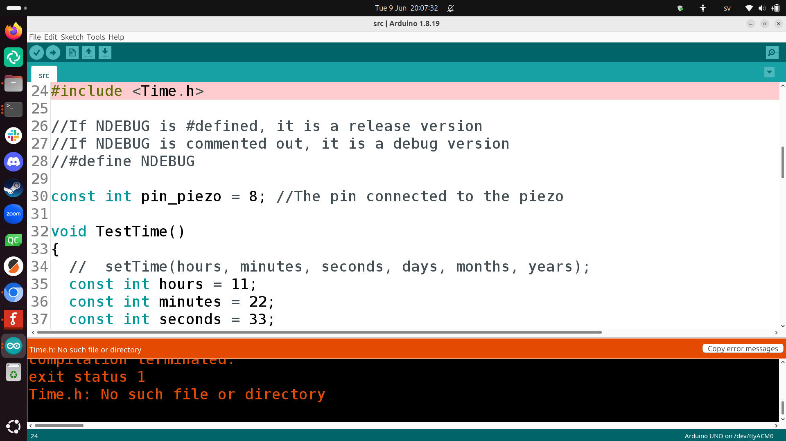
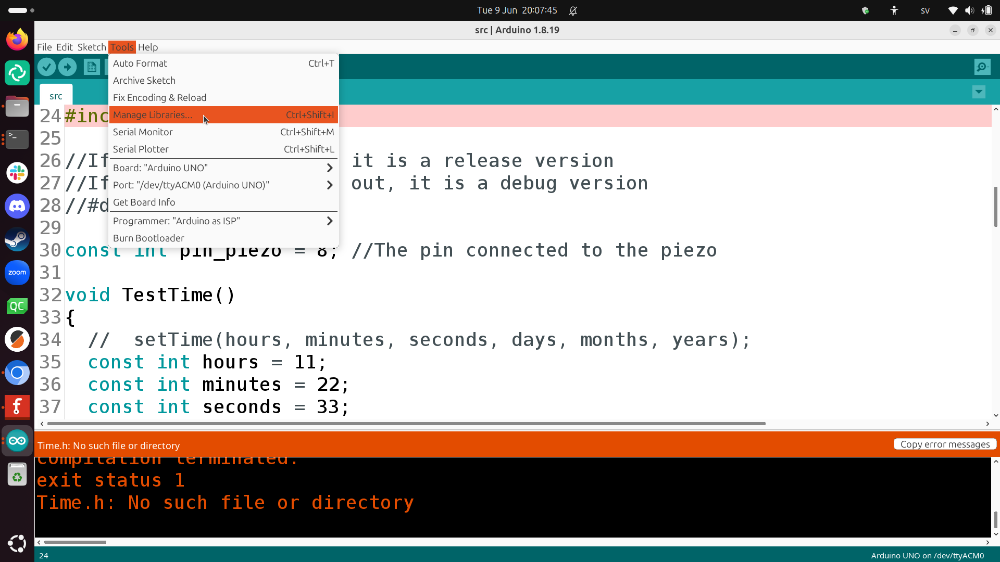
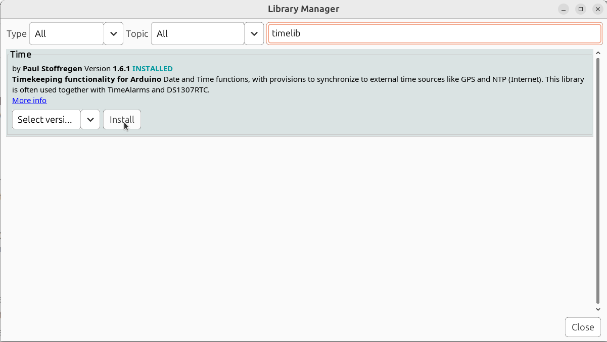

---
tags:
  - upload
  - program
---

# Upload program

We'll use the code of
[the Minimal Pi Clock](https://github.com/richelbilderbeek/MinimalPiClock).

The code can be found in the `src` folder or
be downloaded directly from
[src/src.uno](https://raw.githubusercontent.com/richelbilderbeek/MinimalPiClock/refs/heads/master/src/src.ino).

Upload this code to an Arduino.

If you get a compile error, as shown here:

Click on 'Tools | Manage Libraries' to start the library manager:

In the library manager, search for `timelib`
to find the 'Time' library by Paul Stoffregen.
Click on 'Install' to install it.

