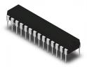
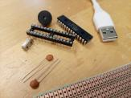
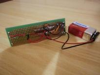
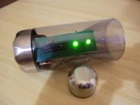

---
tags:
  - Main page
---

# Pi Clock Workshop

## Goal

The goal of this workshop is to be able to create
a bare-bone Arduino machine, i.e. a machine that only
uses the ATmega328P chip of an Arduino
(and not a complete Arduino Uno):

## Event details

- Date: Saturday July 25th 2026
- Time: 12:00 (sharp!) to 14:00 (see [schedule](schedule.md) for detailed schedule)
- Where: electronics workshop
- Language: English, questions can be asked in Swedish
- Costs: free

Other questions? See [the 'Frequently Asked Questions' page](faq.md).

## Procedure

<!-- markdownlint-disable MD013 --><!-- Table rows must be put on one line, hence 80 chars is unavoidable -->

Step|Procedure                                                  |Result                        |Image
----|-----------------------------------------------------------|------------------------------|--------------------------------------------------------------------------------------------------------
1   |[Burn bootloader to chip](burn_bootloader/README.md)       |ATmega328P with bootloader    |
2   |[Upload program to chip](upload_program/README.md)         |ATmega328P with program       |
3   |[Build schematic on breadboard](build_breadboard/README.md)|Minimal Pi Clock on breadboard|

<!-- markdownlint-enable MD013 -->

For those that want to make the Minimal Pi Clock into a real machine,
there are optional additional steps with an additional cost:

<!-- markdownlint-disable MD013 --><!-- Table rows must be put on one line, hence 80 chars is unavoidable -->

Step|Procedure                                                  |Result                             |Image
----|-----------------------------------------------------------|-----------------------------------|-----------------------------------------------------------------------------------------------------
4   |[Buy components](buy_components/README.md)                 |All components needed              |
5   |[Solder the PCB](solder/README.md)                         |Minimal Pi Clock on PCB            |
6   |[Connect the PCB to a casing](connect/README.md)           |Minimal Pi Clock in a pretty casing|

<!-- markdownlint-enable MD013 -->
