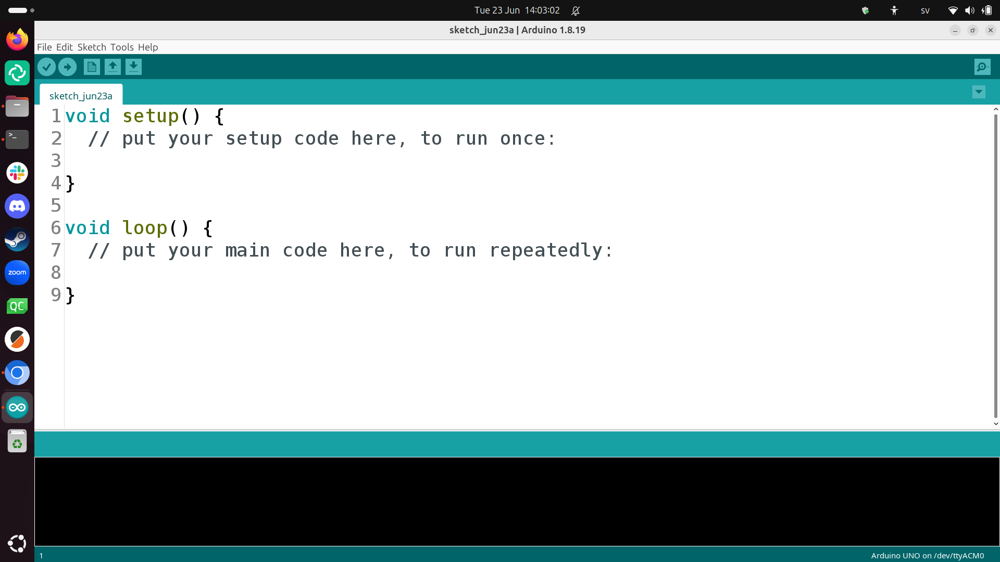
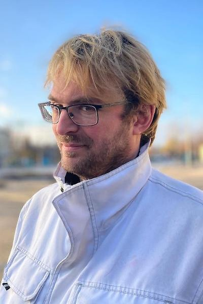

---
tags:
  - FAQ
  - frequently asked questions
---

# FAQ

## What is the goal of the workshop?

See [the goal at the front page](README.md#goal).

## What is meant by 'bare-bone Arduino machine'?

It is a machine that only
uses the ATmega328P chip of an Arduino
(and not a complete Arduino Uno)

## How does the end result look like?

At the end of the workshop, we go home empty-handed.

Before disassembling, we do have a machine on a breadboard:

## Can I keep the components?

No.

You can buy them, however.

## What can I do after this workshop?

After this workshop, you can

- create your own bare-bone Arduino machines:
  just upload some other code
- build the machine:
  for this, you do need to [buy the components](buy_components/README.md).

## At what level is the workshop taught?

At the level of the absolute beginner:
you need to know nothing.

## What do I need to bring?

Nothing.

However, it would be better if you'd bring your own laptop,
ideally with [the Arduino IDE](https://www.arduino.cc/en/software/)
installed.

???- question "How does the Arduino IDE look like?"

    The Arduino IDE is a program that looks similar to this:

    

If not, we will use the laptops in the Uppsala Makerspace.

## In which language will this workshop be taught?

In English, because that is the most inclusive language.

Questions can be asked in Swedish too.

## How much does this workshop cost?

Nothing.

If you want to build the machine,
you do need to [order or buy the components](buy_components/README.md).

## Where do I need to register?

You do not need to register: just show up on time :-)

## Who teaches the workshop?

Richèl, pronounced as 'rea-shell' and rhymes with 'sea shell'.

???- question "How does Richèl look like?"

    He looks similar to this:

    

## How can I contribute?

See [how to contribute](CONTRIBUTING.md).

## I have another question

Great!

You have two options:

- Send an email to `rjcbilderbeek@gmail.com`.
- [Create an issue](https://github.com/richelbilderbeek/build_bare_bone_arduino_machine_workshop/issues)
