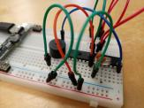

---
tags:
  - FAQ
  - frequently asked questions
---

# FAQ

## What is the goal of the workshop?

The goal of this workshop is to be able to create
a bare-bone Arduino machine.

## What is meant by 'bare-bone Arduino machine'?

It is a machine that only
uses the ATmega328P chip of an Arduino
(and not a complete Arduino Uno)

## How does the end result look like?

At the end of the workshop, we go home empty-handed.

Before disassembling, we do have a machine on a breadboard:

## Can I keep the components?

No.

You can buy them, however.

## What can I do after this workshop?

After this workshop, you can

- create your own bare-bone Arduino machines:
  just upload some other code
- build the machine:
  for this, you do need to [buy the components](buy_components/README.md).
