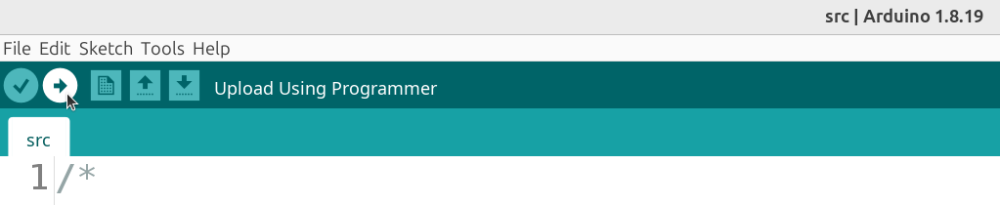

---
tags:
  - upload
  - program
---

# Upload program

We'll use the code of
[the Minimal Pi Clock](https://github.com/richelbilderbeek/minimal_pi_clock).

The code can be found in the `src` folder or
be downloaded directly from
[src/src.uno](https://raw.githubusercontent.com/richelbilderbeek/minimal_pi_clock/refs/heads/main/src/src.ino).

Upload this code to an Arduino.

> Click on 'Upload'
